# Green Room Music Player
## User Story
* Provide user a search function that will provide information from 1 API engine.
* User can create favorites, delete favorites library.
* User must login/create user profile to create favorites list and comments.
* User can leave comments about an album.
* User can watch embedded Youtube videos on the album page.

## Future Functionality:
* Social media sharing capabilities

## Wire Frames
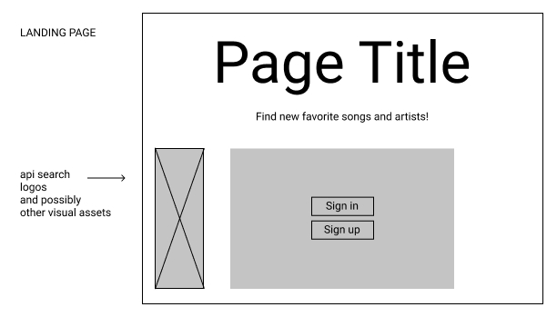

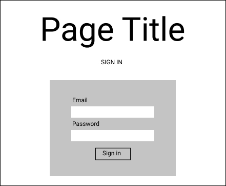

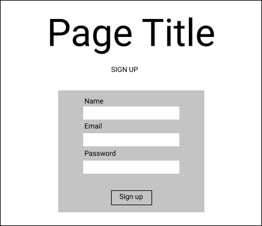

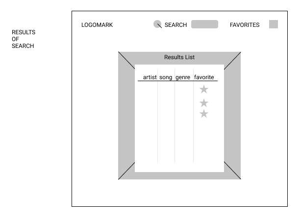

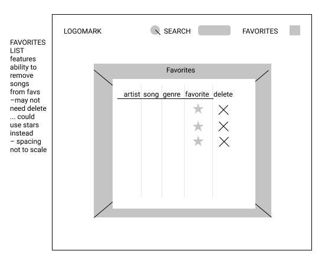

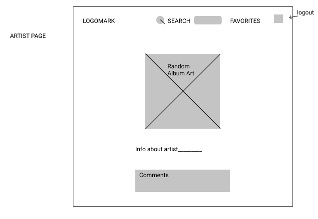

## Work Flow
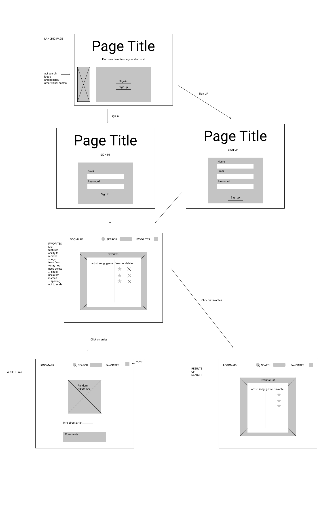

## ERD
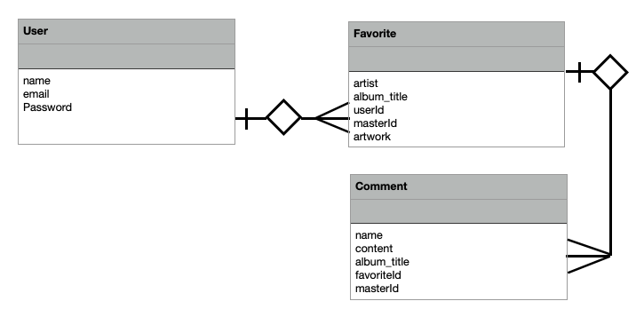

## Code Snipets
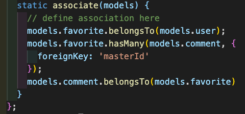

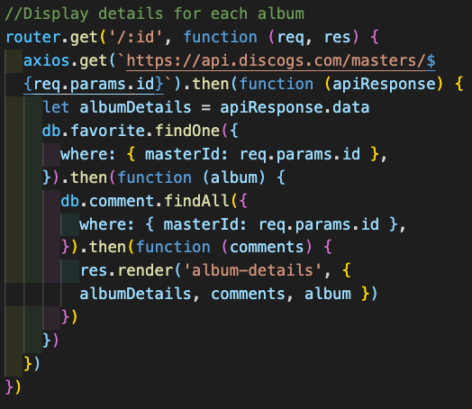

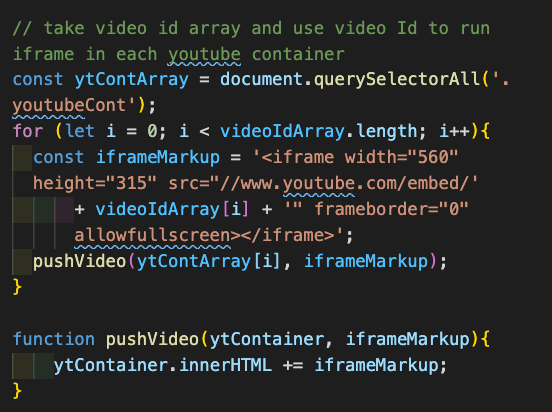

## App
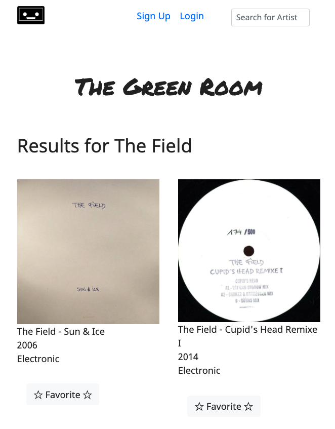

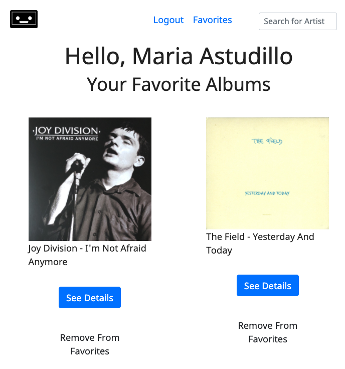

## Feasibility Check
* Read Discogs API documentation
* Use curl to test API functionality
* Write a test script to require from API
* Examine data results for data types
* Research embedding music player