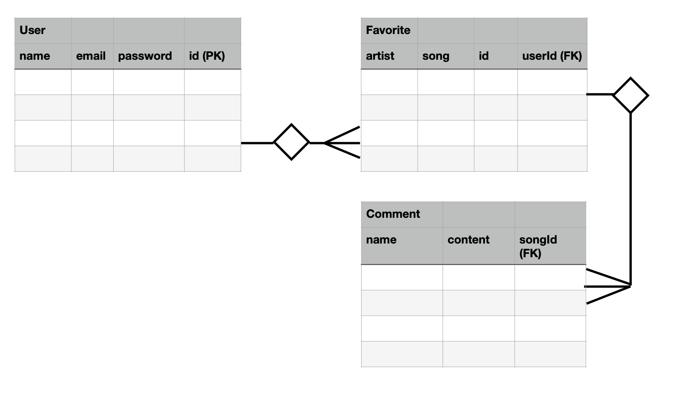

# Green Room Music Player
## Scope
* Provide user a search function that will provide information from 1 API engine.
* User can create favorites, delete favorites library
* User must login/create user profile to create favorites list and comments
* User can leave comments about an artist or song.

## Future Functionality:
* Social media sharing capabilities
* Link or embed Youtube video(s) based on user search/favorite

## Wire Frames

## Work Flow

## ERD

## Feasibility Check
* Read Discogs API documentation
* Read Youtube API documentation (Low Priority)
* Use curl to test API functionality
* Write a test script to require from API
* Examine data results for data types
* Research embedding music player